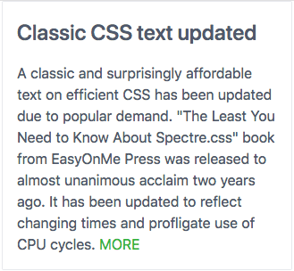
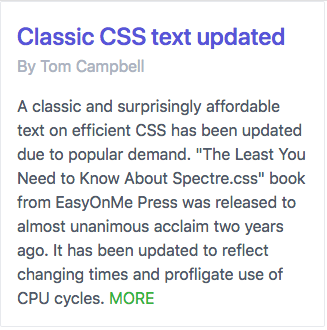
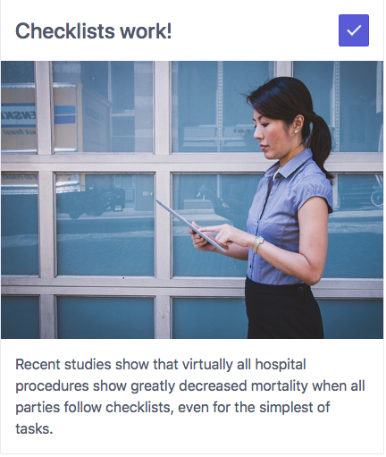

# Cards

TODO:
* Discuss requirement to put it in a grid
* Mention all extras such as text-gray and text-success

[Cards](https://picturepan2.github.io/spectre/components.html#cards) 
display information in panel form, 
presented inside a subtle box outline.
Often they contain an image, a title,
a subtitle, and body text. They can
also contain buttons

## Simple text-only card

A card may contain nothing but text. Normally that would consist of
a title and some sort of body text. Here's an example:



The minimum card is wrapped inside a div of class `card`.
It normally has a `header` div nested inside it, and
within the `header` div is a `card-title` div.

Following that is a div of class `card-body`. Here's an abbreviated example:

```html
<div class="card">
        <div class="card-header">
          <div class="card-title h4">
            Title
          </div><!-- .card-title -->    
        </div><!--- .card-header -->
        <div class="card-body">
            Body text
        </div><!-- .card-body --> 
</div><!-- .card -->

```
Here is that same code expanded to show a more realistic presentation:

```html
<!doctype html>                                                                                                                                          
<html lang="en">                                                             
<head>                                                                     
                       
        <!-- Create title for browser tabs & Favorites -->                                                     
        <title>Text-only card example | Spectre.css</title>                     
        <!-- This site is responsive. Use full screen width. -->                
        <meta name="viewport" content="width=device-width, initial-scale=1.0">
        <!-- Ensure use of most common Unicode characters -->
        <meta charset="utf-8">
        <link rel="stylesheet" href="https://unpkg.com/spectre.css/dist/spectre.min.css">
<style> 
         
</style>           
</head>                                
<body>         
        <div class="container"> 
                <div class="columns">
                        <div class="column col-4">
                             
                                <div class="card">
                                        <div class="card-header">
                                                <div class="card-title h4">
                                                        Classic CSS text updated
                                                </div><!-- .card-title -->    
                                        </div><!--- .card-header -->
                                        <div class="card-body">
                                                A classic and surprisingly affordable
                                                text on efficient CSS has been updated
                                                due to popular demand.
                                        
                                                "The Least You Need to Know About Spectre.css" book 
                                                from EasyOnMe Press was released to almost
                                                unanimous acclaim two years ago. It has
                                                been updated to reflect changing times
                                                and profligate use of CPU cycles.
                                  
                                                <a href="#"><span class="text-success">MORE</a>
                                  
                                        </div><!-- .card-body --> 
                                </div><!-- .card -->
                     
                        </div>
                </div>
        </div><!-- .container -->
</body>                      
```

[Complete file source](https://github.com/tomcam/spectre-book/blob/master/code/card-title-body-only.html), 
[Preview](https://htmlpreview.github.com/?https://github.com/tomcam/spectre-book/blob/master/code/card-title-body-only.html)

### Note

Note that along with the `card-title` style an `h4` style is used. 
By default card titles have no distinguishing characteristics.
That's a good time to use the inline `h4` style, which preserves
the visual characteristics of an `<h4>` header but without forcing a line break.

## Adding a subtitle to a card

This next example is similar. It adds a `card-subtitle` div and uses the
inline `h4` style. Experiment with others such as `h1` or `h3`.

Here's the a screen shot:



Here's an excerpt from the code:

```html
<div class="card">
        <div class="card-header">
                <div class="card-title h4">
                        <span class="text-primary">
                                Classic CSS text updated
                        </span>
                </div>
                <div class="card-subtitle text-gray">
                        By Tom Campbell	
                </div>
        </div>
        <div class="card-body">
                A classic and surprisingly affordable
                text on efficient CSS has been updated
                due to popular demand.

                "The Least You Need to Know About Spectre.css" book 
                from EasyOnMe Press was released to almost
                unanimous acclaim two years ago. It has
                been updated to reflect changing times
                and profligate use of CPU cycles.

                <a href="#"><span class="text-success">MORE</a>

        </div>
</div>

```

[Complete file source](https://github.com/tomcam/spectre-book/blob/master/code/card-title-subtitle-body.html), 
[Preview](https://htmlpreview.github.com/?https://github.com/tomcam/spectre-book/blob/master/code/card-title-subtitle-body.html)

## Simple card with image

Cards come into their own when they house images. Take a look at this
simple example showing a card with an image on top, a title, and some body text.


To add an image just add a div of class `card-image` anywhere 
inside the `card` div. Here's some skeletal example code:

```html
<div class="card">
        <div class="card-image">
                
        </div>
        <div class="card-header">
                <div class="card-title h4">
                </div>
        </div>
        <div class="card-body">
        </div>
</div>
```

Here is a complete code listing with a sample image and typical text.

```html
<!doctype html>
<html lang="en">
<head>

	<!-- Create title for browser tabs & Favorites -->
	<title>Card with image on top | Spectre.css</title>
	<!-- This site is responsive. Use full screen width. -->
	<meta name="viewport" content="width=device-width, initial-scale=1.0">
	<!-- Ensure use of most common Unicode characters -->
	<meta charset="utf-8">
	<link rel="stylesheet" href="https://unpkg.com/spectre.css/dist/spectre.min.css">
<style>

</style>
</head>
<body>
	<div class="container">
		<div class="columns">
			<div class="column col-4">

				<div class="card">
					<div class="card-image">
						
					</div>
					<div class="card-header">
						<div class="card-title h4">
							Checklists work!	
						</div>
					</div>
					<div class="card-body">
						Recent studies show that 
						virtually all hospital procedures
						show greatly decreased mortality
						when all parties follow
						checklists, even for the
						simplest of tasks.
					</div>
				</div>

			</div>
		</div>
	</div><!-- .container -->
</body>

```

[Complete file source](https://github.com/tomcam/spectre-book/blob/master/code/card-image-top.html), 
[Preview](https://htmlpreview.github.com/?https://github.com/tomcam/spectre-book/blob/master/code/card-image-top.html)

## Simple card with image and float-right icon

One neat example of the `float-right` class in the Spectre.css documentation is adding an incon
to the right of text or headline, like this:



Here's the relevant code:

```html
<div class="card">
	<div class="card-header">
		<button class="btn btn-primary float-right"><i class="icon icon-check"></i></button>
		<div class="card-title h4">
			Checklists work!	
		</div>
	</div>
	<div class="card-image">
		
	</div>
	<div class="card-body">
		Recent studies show that 
		virtually all hospital procedures
		show greatly decreased mortality
		when all parties follow
		checklists, even for the
		simplest of tasks.
	</div>
</div>
```

The complete listing:

```html
<!doctype html>
<html lang="en">
<head>

	<!-- Create title for browser tabs & Favorites -->
	<title>Card with image on top, float-right check icon | Spectre.css</title>
	<!-- This site is responsive. Use full screen width. -->
	<meta name="viewport" content="width=device-width, initial-scale=1.0">
	<!-- Ensure use of most common Unicode characters -->
	<meta charset="utf-8">
	<link rel="stylesheet" href="https://unpkg.com/spectre.css/dist/spectre.min.css">
	<link rel="stylesheet" href="https://unpkg.com/spectre.css/dist/spectre-icons.min.css">
<style>

</style>
</head>
<body>
	<div class="container">
		<div class="columns">
			<div class="column col-4">

				<div class="card">
					<div class="card-header">
						<button class="btn btn-primary float-right"><i class="icon icon-check"></i></button>
						<div class="card-title h4">
							Checklists work!	
						</div>
					</div>
					<div class="card-image">
						
					</div>
					<div class="card-body">
						Recent studies show that 
						virtually all hospital procedures
						show greatly decreased mortality
						when all parties follow
						checklists, even for the
						simplest of tasks.
					</div>
				</div>

			</div>
		</div>
	</div><!-- .container -->
</body>
```
[Current file source](https://github.com/tomcam/spectre-book/blob/master/code/card-image-top-check.html), 
[Preview](https://htmlpreview.github.com/?https://github.com/tomcam/spectre-book/blob/master/code/card-image-top-check.htmll)


## Reference

* SCSS source for the Spectre.css [cards implementation](https://github.com/picturepan2/spectre/blob/master/src/_cards.scss)
* Spectre.css documentation for [cards](https://picturepan2.github.io/spectre/components.html#cards)
* [Full spectre.css style sheet](https://github.com/picturepan2/spectre/blob/master/dist/spectre.css) on GitHub 

