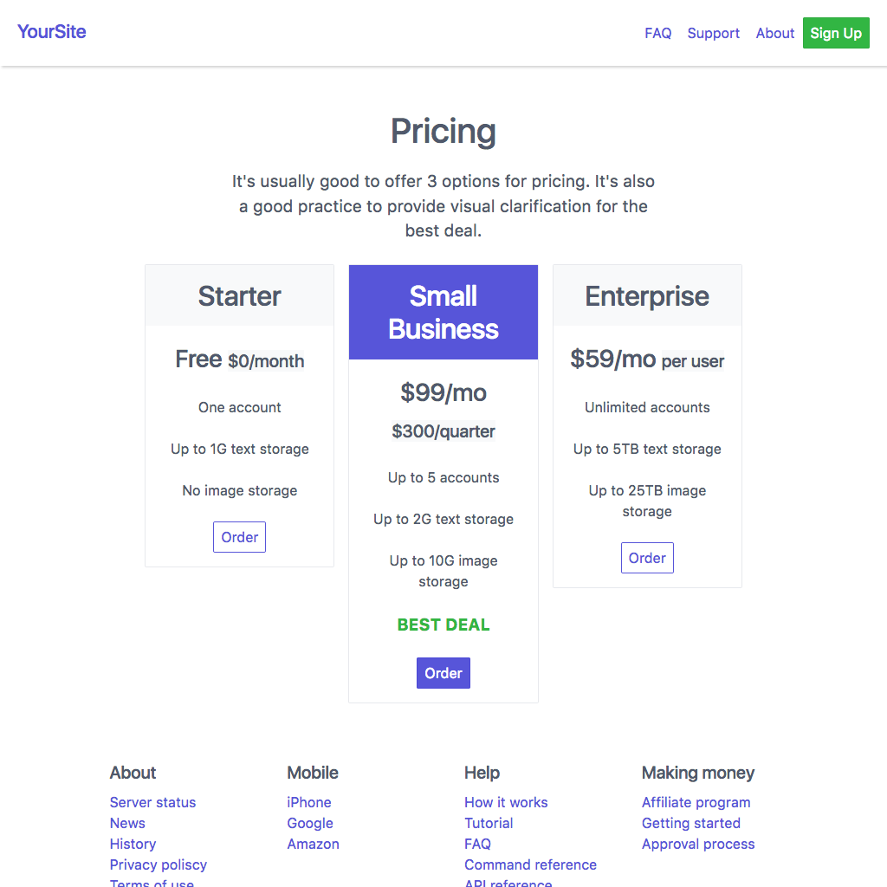

# Spectre.css Templates

Here's a selection of drop-in HTML files you can use to start a Spectre.css-based site. Each project below contains a description, a pointer to the code, and **live previews of the code** all on this page.

## How to use these free Spectre.css templates

Most of these templates are designed so that you can copy them into a local directory on your machine or sever and they should just work. In some cases you may need image files in a subdirectory named images. You don't even need Spectre.css on your machine, because they are hosted on a CDN. Which means..

### Production and compatibility warning

It's likely that by the time you read this the version of Spectre.css used in these examples is outdated. Or it's possible that the CDN is down. So for production purposes you should copy the [Spectre.css style sheets](https://github.com/picturepan2/spectre/tree/master/docs/dist) from GitHub to your development machine.

## Free Spectre.css website templates

## 2col-4col-page-header

Header, followed by two wide columns, followed by two columns under each of the 
previous two columns. 

[GitHub Source](https://github.com/tomcam/spectre-book/blob/master/examples/2col-4col-page-header.html), [Preview](https://htmlpreview.github.com/?https://github.com/tomcam/spectre-book/blob/master/examples/2col-4col-page-header.html)

## 2col-page

Simple, bold page with 1 column filling each side of the page. [GitHub Source](https://github.com/tomcam/spectre-book/blob/master/examples/2col-page.html), [Preview](https://htmlpreview.github.com/?https://github.com/tomcam/spectre-book/blob/master/examples/2col-page.html)

## 2col-blog

Blog with the left column reserved as a sidebar/title,
and the right column devoted to text. [GitHub Source](https://github.com/tomcam/spectre-book/blob/master/examples/2col-blog.html), [Preview](https://htmlpreview.github.com/?https://github.com/tomcam/spectre-book/blob/master/examples/2col-blog.html)

## gallery-pricing

Classic three-tier pricing page 

[GitHub Source](https://github.com/tomcam/spectre-book/blob/master/examples/gallery-pricing.html), [Preview](https://htmlpreview.github.com/?https://github.com/tomcam/spectre-book/blob/master/examples/gallery-pricing.html)

## min-nav.html

Minimum template with navbar. [GitHub Source](https://github.com/tomcam/spectre-book/blob/master/examples/min-nav.html), [Preview](https://htmlpreview.github.com/?https://github.com/tomcam/spectre-book/blob/master/examples/min-nav.html)

## plain-nav.html

Template with plain navbar. [GitHub Source](https://github.com/tomcam/spectre-book/blob/master/examples/plain-nav.html), [Preview](https://htmlpreview.github.com/?https://github.com/tomcam/spectre-book/blob/master/examples/plain-nav.html)

<!--
**XXX** Minimum template with navbar. [GitHub Source](https://github.com/tomcam/spectre-book/blob/master/examples/sss.html), [Preview](https://htmlpreview.github.com/?https://github.com/tomcam/spectre-book/blob/master/examples/xxx.html)
-->
