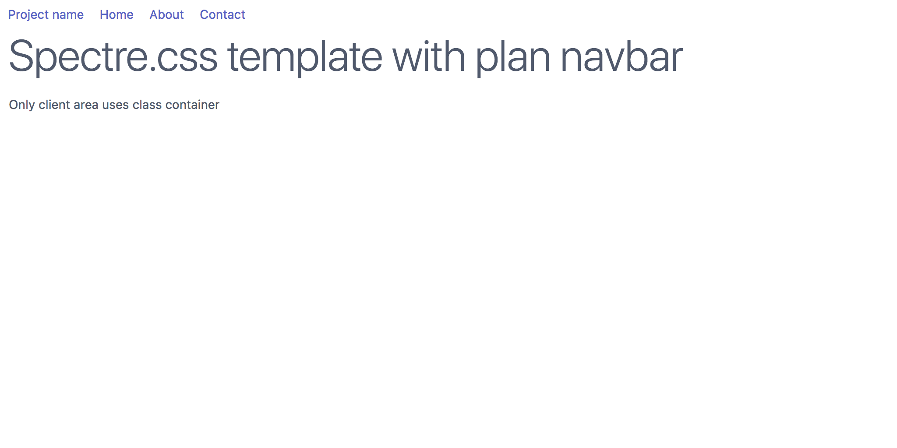

# Spectre.css tutorial: Your first Spectre.css project

## The simplest HTML document using Spectre.css

The minimal HTML document using Spectre.css simply includes the file spectre.min.css.
It resets fonts, margins, and a few other document elements to pleasing defaults
that look identical on all browsers.

File `min.html` [GitHub Source](https://github.com/tomcam/spectre-book/blob/master/examples/min.html), 
[Preview](https://htmlpreview.github.com/?https://github.com/tomcam/spectre-book/blob/master/examples/min.html)

```html
<!doctype html>
<html lang="en">
<head>
	<meta charset="utf-8">
	<meta name="viewport" content="width=device-width, initial-scale=1.0">
	<title>Minimal template | Spectre.css</title>
	<link rel="stylesheet" href="https://unpkg.com/spectre.css/dist/spectre.min.css" />
</head>
<body>
	<h1>Minimal Spectre.css template</h1>
	<p>CSS reset looks identical on all major browsers</p>
</body>
</html>
```

Here's the resulting web page:


## Adding a plain navbar

Modern websites almost always have a specialized menu at the top of the page called a <em>navbar</em>. Here's the simplest 
Spectre.css navbar. Our page is already looking pretty good in just 24 lines of code, including comments.

File `plain-nav.html` [GitHub Source](https://github.com/tomcam/spectre-book/blob/master/examples/plain-nav.html), 
[Preview](https://htmlpreview.github.com/?https://github.com/tomcam/spectre-book/blob/master/examples/plain-nav.html)

```html
<!doctype html>
<html lang="en">
<head>
	<meta charset="utf-8">
	<meta name="viewport" content="width=device-width, initial-scale=1.0">
	<title>Plan navbar template | Spectre.css</title>
	<meta name="description" content="Plain navbar template">
	<meta name="keywords" content="navbar template">	
	<link rel="stylesheet" href="https://unpkg.com/spectre.css/dist/spectre.min.css" />
</head>
<body>
	<header class="navbar">
		<!-- Plain navbar with no branded link or selected item -->
		<div class="navbar-primary">	
			<a href="#" class="btn btn-link">Project name</a>
			<a href="#" class="btn btn-link">Home</a>
			<a href="#" class="btn btn-link">About</a> 
			<a href="#" class="btn btn-link">Contact</a> 
		</div>
	</header><!-- .navbar -->
	 
	<div class="container">
		<h1>Spectre.css template with plan navbar</h1>
		<p>Only client area uses class container</p>
	</div>
</body>
</html>

```




