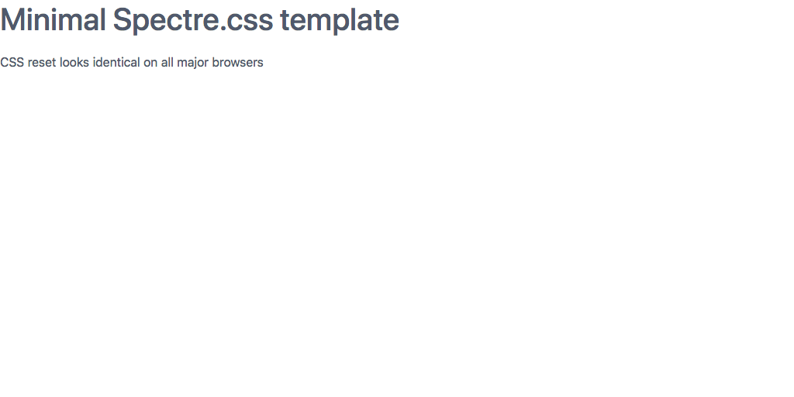

# Spectre.css tutorial: Your first Spectre.css project

## The simplest HTML document using Spectre.css

The minimal HTML document using Spectre.css simply includes the file spectre.min.css,
but this book tries to keep things closer to realistic. 
For the most part you will normally want to use the class `container` on your `div`s 
because it sets a reasonable default for margins.

File `min.html` [GitHub Source](https://github.com/tomcam/spectre-book/blob/master/examples/min.html), 
[Preview](https://htmlpreview.github.com/?https://github.com/tomcam/spectre-book/blob/master/examples/min.html)

```html
<!doctype html>
<html lang="en">
<head>
	<meta charset="utf-8">
	<meta name="viewport" content="width=device-width, initial-scale=1.0">
	<title>Minimal template | Spectre.css</title>
	<link rel="stylesheet" href="https://unpkg.com/spectre.css/dist/spectre.min.css" />
</head>
<body>
 	<div class="container">
		<h1>Minimal Spectre.css template</h1>
		<p>Entire page within div of class container</p>
	</div><!-- .container -->
</body>
</html>
```

Here's the resulting web page:




## Adding a plain navbar

Modern websites almost always have a distinguished menu at the top of the page called a navbar. Here's the simplest 
Spectre.css navbar. Our page is already looking pretty good in just 24 lines of code, including comments.

File `plain-nav.html` [GitHub Source](https://github.com/tomcam/spectre-book/blob/master/examples/plain-nav.html), 
[Preview](https://htmlpreview.github.com/?https://github.com/tomcam/spectre-book/blob/master/examples/plain-nav.html)

```html
<!doctype html>
<html lang="en">
<head>
	<meta charset="utf-8">
	<meta name="viewport" content="width=device-width, initial-scale=1.0">
	<title>Plan navbar template | Spectre.css</title>
	<meta name="description" content="Plain navbar template">
	<meta name="keywords" content="navbar template">	
	<link rel="stylesheet" href="https://cdnjs.cloudflare.com/ajax/libs/spectre.css/0.2.10/spectre.min.css" />
</head>
<body>
	<header class="navbar">
		<!-- Plain navbar with no branded link or selected item -->
		<div class="navbar-primary">	
			<a href="#" class="btn btn-link">Project name</a>
			<a href="#" class="btn btn-link">Home</a>
			<a href="#" class="btn btn-link">About</a> 
			<a href="#" class="btn btn-link">Contact</a> 
		</div>
	</header><!-- .navbar -->
	
	<div class="container">
		<h1>Spectre.css template with plan navbar</h1>
		<p>Only client area uses class container</p>
	</div>
</body>
</html>

```


The most common 
<!--
**XXX** XXX. [GitHub Source](https://github.com/tomcam/spectre-book/blob/master/examples/xxx.html), 
[Preview](https://htmlpreview.github.com/?https://github.com/tomcam/spectre-book/blob/master/examples/xxx.html)
-->
