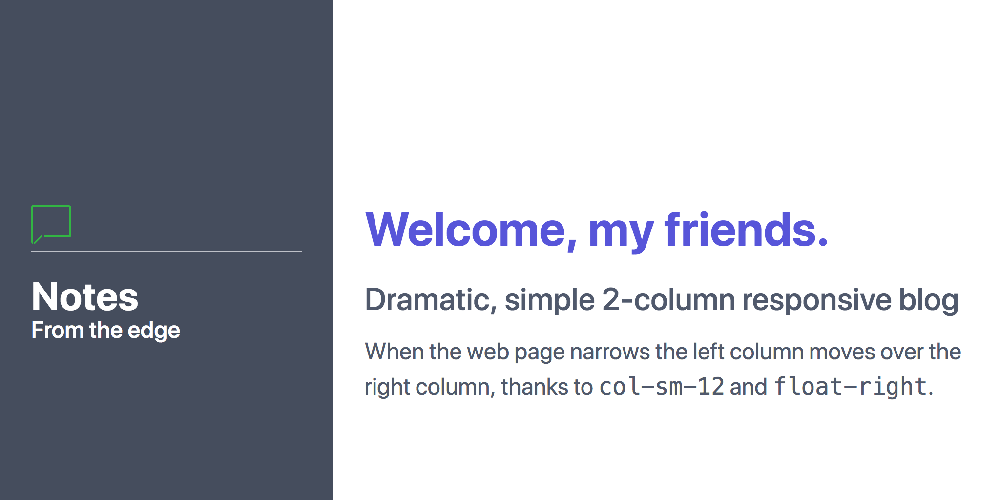

# The grid model

## A Grids is enclosed in a div of type "container"

A grid must be inside a div of type `container`:

```html
	<div class="container">
	</div><!-- .container -->
```

## Each row is enclosed in a div of class "columns"

A grid is made up of rows. Each row is a div designated,
sadly, with the term `column`. 
Here's a grid with a single row:

```html
	<div class="container">
		<div class="columns">
			<h1>Row 1</h1>
		</div><!-- .columns -->
	</div><!--  .container -->
```

To add a row, insert another div of type "columns" 
at peer level, within the "container" div:

```html
	<div class="container">
		<div class="columns">
			<h1>Row 1</h1>
		</div><!-- .columns -->
		<div class="columns">
			<h1>Row 2</h1>
		</div><!-- .columns -->
	</div><!--  .container -->
```


## A grid has 12 columns

A grid is thought to be 12 columns wide.

```html
	<div class="container">
		<!-- The top "cap" with the h1 in it -->
		<div class="columns">
			
			<!-- hide-lg makes the left column disappear when width is decreased -->
			<div class="column">
			</div>

			<div class="column col-6 text-center" style="border: 1px solid black;">
				<h1>Top-level header</h1>
			</div>
			
			<div class="column col-3 hide-lg">
			</div>
			
		</div><!-- .columns -->
	</div><!--  .container -->
```

[Complete file source](https://github.com/tomcam/spectre-book/blob/master/examples/illo-header-3col-bottom-a.html), 
[Preview](https://htmlpreview.github.com/?https://github.com/tomcam/spectre-book/blob/master/examples/illo-header-3col-bottom-a.html)


File `2col-blog.html` [GitHub Source](https://github.com/tomcam/spectre-book/blob/master/examples/2col-blog.html), 
[Preview](https://htmlpreview.github.com/?https://github.com/tomcam/spectre-book/blob/master/examples/2col-blog.html)

```html
<!doctype html>
<html lang="en">
<head>
	<!-- Create title for browser tabs & Favorites -->
	<title>2col-blog template | Spectre.css</title>
	<!-- Notify browsers this page is in Unicode -->
	<meta charset="utf-8">
	<!-- This site is responsive. Use full screen width. -->
	<meta name="viewport" content="width=device-width, initial-scale=1.0">
	<meta name="description" content="2 column blog template">
	<meta name="keywords" content="spectre.css, blog, 2 columns, template">	
	<link rel="stylesheet" href="https://unpkg.com/spectre.css/dist/spectre.min.css">
	<link rel="stylesheet" href="https://unpkg.com/spectre.css/dist/spectre-exp.min.css">
	<link rel="stylesheet" href="https://unpkg.com/spectre.css/dist/spectre-icons.min.css">
	<style>
		p { font-size: 1.5em;}	
		h1 { font-size: 3em; }
		h3 { font-size: 2rem; line-height: 1em; margin-bottom: 0; }
		h1, h3 { font-weight: 700; }
		h4 { margin-bottom: 0;}
		.titlecol { height: 100vh; }		
	</style>
</head>
<body>
	<div class="container">
		<div class="columns">
			<!-- LEFT COLUMN -->
			<div class="column col-4 col-sm-12 float-right bg-dark text-light titlecol" 
				style="padding-top: 20%; padding-left: 2em; padding-right: 2em;";>
				<h3><i class="icon icon-message text-success"></i></h3>
				<div class="divider" style="padding-top: 1em;"></div>
				<h3>Notes</h3>
				<h4>From the edge</h4>
			</div><!-- .column .col-4 .col-sm-12 -->

			<!-- RIGHT COLUMN-CLIENT AREA -->
			<div class="column col-8 col-sm-12 float-left"  
				style="padding-top: 20%; padding-left: 2em;">		
				<h1 class="text-primary">Welcome, my friends.</h1> 
				<h2>Dramatic, simple 2-column responsive blog</h2>
				<p>When the web page narrows the left column 
					moves over the right column, thanks
					to <samp>col-sm-12</samp> 
					and  <samp>float-right</samp>.</p>
			</div><!-- .column .col-8 .col-sm-12 -->

		</div><!-- .columns -->
	</div><!-- .container  -->
</body>
```

Here's the resulting web page:


