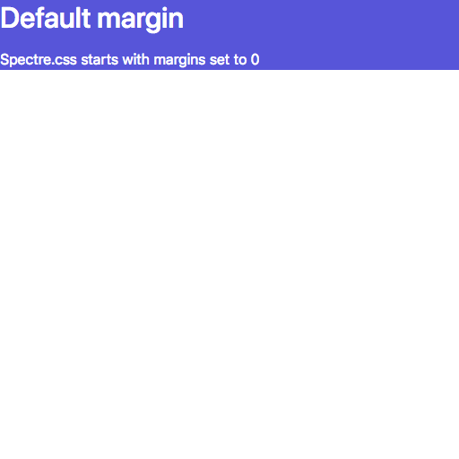
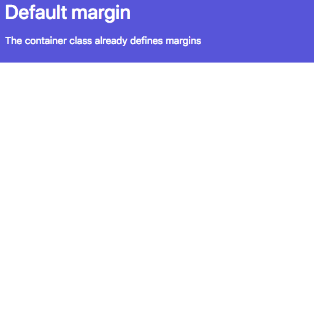
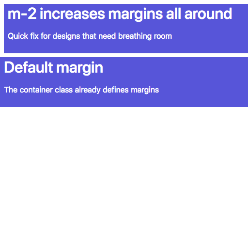

# Margins and padding

Spectre.css has a set of utilities for margins
and padding that let you make tweaks to your
designs in systematic ways.

# Margins are reset to 0 all around

The first thing Spectre.css does is what used to be
called a style "reset", which is to establish defaults
for fonts, margins, padding and so forth that look as close
to identical as possible on all browsers.

Here's a short HTML showing those defaults, with
the default colors changed to the [bg-primary](colors.md#bg-primary)
style for clarity.

```html
<!doctype html>
<html lang="en">
<head>
	<!-- Create title for browser tabs & Favorites -->
	<title>Empty example | Spectre.css</title>
	<!-- This site is responsive. Use full screen width. -->
	<meta name="viewport" content="width=device-width, initial-scale=1.0">
	<!-- Ensure use of most common Unicode characters -->
	<meta charset="utf-8">
	<link rel="stylesheet" href="https://unpkg.com/spectre.css/dist/spectre.min.css">
</head>

<body>
	<!-- bg-primary is white text on purple background. -->	
	<div class="bg-primary" >
		<h2>Default margin</h2>
		<p>Spectre.css starts with margins set to 0</p>
	</div>
</body>
```
File `empty-example.html` [GitHub Source](https://github.com/tomcam/spectre-book/blob/master/code/empty-example.html
), 
[Preview](https://htmlpreview.github.com/?https://github.com/tomcam/spectre-book/blob/master/code/empty-example.html
)



## Container class has sensible default margins

The `container` class starts with attractive defaults.
```
<!doctype html>
<html lang="en">
<head>
	<!-- Create title for browser tabs & Favorites -->
	<title>Margin examples | Spectre.css</title>
	<!-- This site is responsive. Use full screen width. -->
	<meta name="viewport" content="width=device-width, initial-scale=1.0">
	<!-- Ensure use of most common Unicode characters -->
	<meta charset="utf-8">
	<link rel="stylesheet" href="https://unpkg.com/spectre.css/dist/spectre.min.css">
</head>
<!-- bg-primary is white text on purple background. -->
<!-- m-2 adds small margin all around -->
<body class="bg-primary m-2">
	<h2>Example of a an h2 heading</h2>
	<p>The above is a sematically an h2.</p>

	<p class="h2">Example of p tag using an h2 style</p>
	<p>The above is a p tag using h2 styling.
	It is semantically just paragraph, not a header.</p>

	<h2>This h2 has an <span class="h5">h5-styled portion</span></h2>
	<p>It is semantically a level 2 header.</p>

	<h5 class="h2">Example of an h5 styled as an h2</h5>
	<p>Semantically of course this is an h5, not an h2.</p>
</body>
```
File `container-example-1.html` [GitHub Source](https://github.com/tomcam/spectre-book/blob/master/code/container-example-1.html
), 
[Preview](https://htmlpreview.github.com/?https://github.com/tomcam/spectre-book/blob/master/code/container-example-1.html
)



File `m2-example.html` [GitHub Source](https://github.com/tomcam/spectre-book/blob/master/code/m2-example.html
), 
[Preview](https://htmlpreview.github.com/?https://github.com/tomcam/spectre-book/blob/master/code/m2-example.html
)



