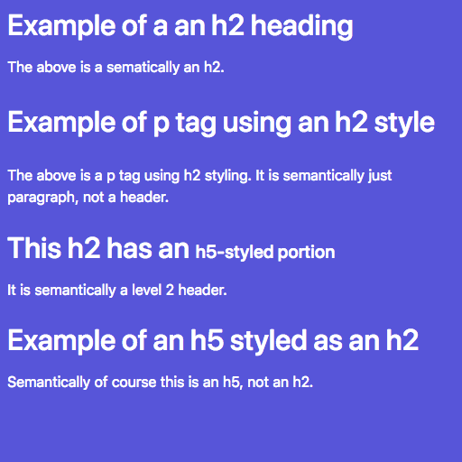

# Text and Spectre.css

## Headers have matching CSS classes

Spectre.css creates its own default styles for headers `<h1>` through `<h6>`.
But it also creates matching style classes. This has a number of uses.
For example, you can style a paragraph to look like a header if the
paragraph is semantically unimportant.

Or you may wish to show part of one header in the style of
another. You can see all of these options illustrated 
here:


```html
<h2>Example of a an h2 heading</h2>
<p>The above is a sematically an h2.</p>

<p class="h2">Example of p tag using an h2 style</p>
<p>The above is a p tag using h2 styling.
It is semantically just paragraph, not a header.</p>

<h2>This h2 has an <span class="h5">h5-styled portion</span></h2>
<p>It is semantically a level 2 header.</p>

<h5 class="h2">Example of an h5 styled as an h2</h5>
<p>Semantically of course this is an h5, not an h2.</p>
```

File `text-example-1.html` [GitHub Source](https://github.com/tomcam/spectre-book/blob/master/code/text-example-1.html
), 
[Preview](https://htmlpreview.github.com/?https://github.com/tomcam/spectre-book/blob/master/code/text-example-1.html
)



